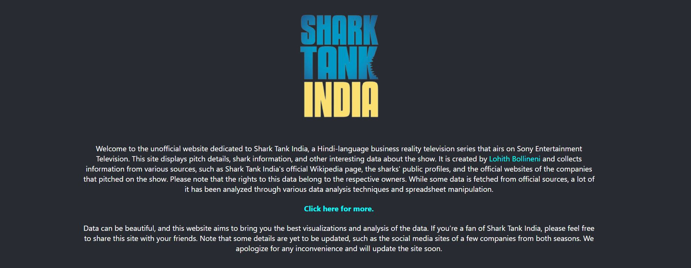

  

# Welcome to the Unofficial Website for Shark Tank India

This website is dedicated to Shark Tank India, a Hindi-language business reality television series that airs on Sony Entertainment Television. On this site, you can find pitch details, shark information, and other interesting data about the show. 

The website is created by Lohith Bollineni and collects information from various sources, such as Shark Tank India's official Wikipedia page, the sharks' public profiles, and the official websites of the companies that pitched on the show. 

Please note that while some data is fetched from official sources, a lot of it has been analyzed through various data analysis techniques and spreadsheet manipulation. The rights to this data belong to the respective owners.

The website is live at: [https://sharktank-india.web.app/](https://sharktank-india.web.app/)

## Screenshots

  

  

  

## Data Analysis and Visualization

Data can be beautiful, and this website aims to bring you the best visualizations and analysis of the data. If you're a fan of Shark Tank India, please feel free to share this site with your friends.

Interested to see more such data and charts? You can also look at the complete list of pithces and details of each pitch.
Check out [https://sharktankindia.streamlit.app/](https://sharktankindia.streamlit.app/) !!

  

  

  

  

  

## Note

Some details are yet to be updated, such as the social media sites of a few companies from both seasons. We apologize for any inconvenience and will update the site soon.
